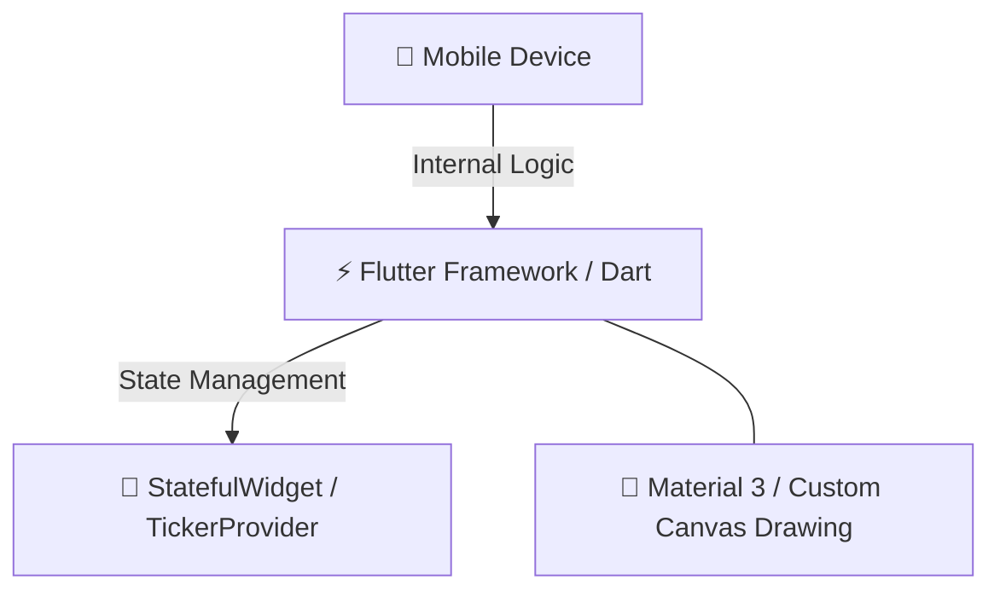

# 🎓 Smart Campus Navigator

A premium, interactive mobile application designed to simplify navigation within a college campus. The system bridges the gap between students, staff, parents, and guests by providing a seamless multi-floor interactive map and tailored role-based access.

---

## 🛠️ Tech Stack & Architecture



### 💻 Frontend Architecture
*   **Flutter (Dart)** – High-performance cross-platform mobile framework.
*   **State Management** – StatefulWidget and TickerProvider used for dynamic UI state and smooth animations.
*   **Material 3 & Canvas** – Modern UI design system with custom drawing to render an interactive map.

---

## 🚀 Key Modules & System Workflow

### ✨ Interactive Splash Screen
*   **Pulsing Logo** – Smooth animations for a modern feel.
*   **Fast Loading** – 0-100% progress tracking in under 2 seconds.

### 🔐 Role-Based Authentication
*   **Tailored Experience** – 4 distinct user roles (Student, Staff, Parent, Guest).
*   **Direct Access** – Parents and Guests can access maps immediately without credentials.
*   **Protected Access** – Robust validation and secure logout redirection for Students and Staff.

### 🗺️ Dynamic Interactive Map
*   **Indoor Navigation** – Navigate specifically within the campus across **3 floors**.
*   **Smart Pathfinding** – High-visibility green paths to indoor locations (e.g., Computer Lab 3 on Floor 3).
*   **Live Guidance** – Simulated user movement along paths with voice and mic integration.
*   **Smart UI** – Auto-hiding navigation bars during active travel for a focused experience.

### 🔎 Smart Search & Discovery
*   **Voice Search** – Integrated mic for hands-free location discovery.
*   **Recent Places** – Quickly return to frequently visited spots.
*   **Quick Categories** – Explore labs, libraries, offices, and more.

### ⚙️ Campus Help & Profile
*   **Feedback Center** – Functional form to submit suggestions and report issues with success alerts.
*   **Profile Management** – Modern edit profile functionality and saved locations.
*   **System Preferences** – Customizable app preferences including font size and style.

---

## 🖥️ System Requirements

*   **Operating System:** Minimum Android SDK version compatible with the latest Flutter engine.
*   **Memory:** 2 GB baseline RAM for smooth map rendering.
*   **Storage Space:** At least 50 MB local storage for the installed app and cached assets.

---

## 📦 Local Installation Guide

1.  **Clone the Repository**
    ```bash
    git clone https://github.com/your-repo/smart-campus-navigator.git
    cd smart-campus-navigator
    ```

2.  **Install Dependencies**
    *   Navigate into the project directory and fetch required packages using Flutter's package manager:
    ```bash
    flutter pub get
    ```

3.  **Run the Live System**
    *   Connect your mobile device or start a local emulator.
    *   Launch the app via your terminal/IDE:
    ```bash
    flutter run
    ```
